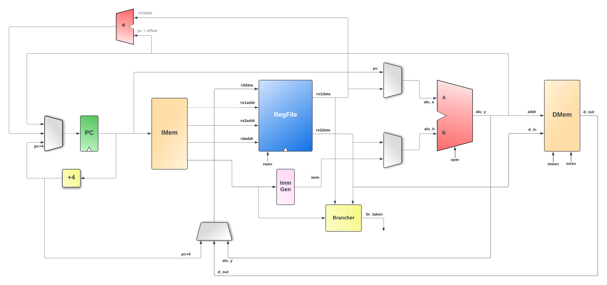

EEK! RISC-V Project
===================

This is my version of a RISC-V processor, created in Chisel, specifically RV32I ISA (for now).

I am using this to learn (or rather re-learn) hardware design and Chisel/Scala at the same time.

More information to follow, as this is very much a work in progress. As such, it may contain errors and incomplete or inefficient code for which I won't apologise. 😉

## Datapath Diagram

